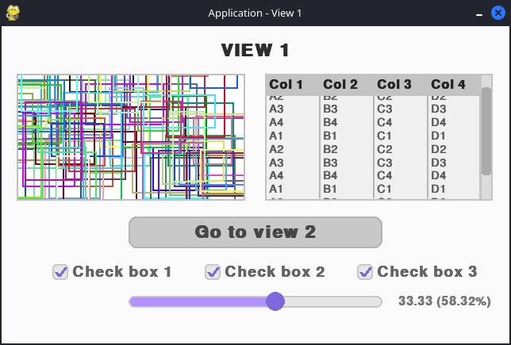
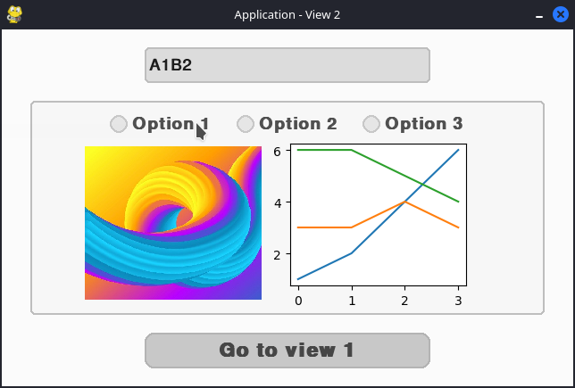
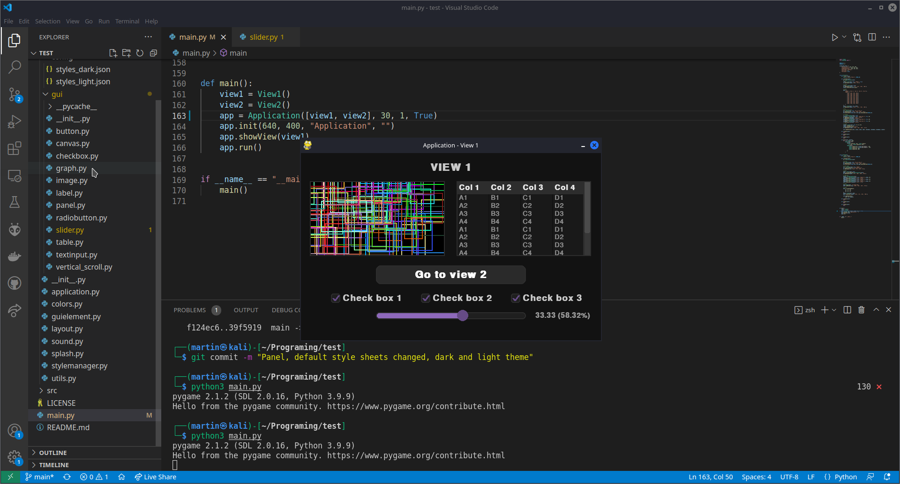

# SUILib
_A simple lightweight UI library for Pygame_


SUILib is a simple, flexible UI library for [Pygame](https://www.pygame.org/).  
Easily build interactive applications or games with multiple views, rich UI elements, and customizable stylesheets.  
Switch between light and dark themes, or define your own look!

---

## Installation 🚀

**Prepare virtual environment:**
```sh
python -m venv venv
source venv/bin/activate  # On Windows: venv\Scripts\activate
```

**Install dependencies:**
```sh
pip install -r requirements.txt
```

**Install SUILib in development mode:**
```sh
pip install -e .
```

---

## Features & Elements ✨

**Main Components**
- ` Application `  ` View `  ` StyleManager `

**Layouts**
- ` RelativeLayout `  ` AbsoluteLayout `

**UI Elements**
- ` Label `  ` Panel `  ` Button `  ` ToggleButton `  ` TextInput `  ` CheckBox `  
- ` RadioButton `  ` RadioButtonGroup `  ` ComboBox `  ` TabPanel `  ` Tab `  
- ` ListPanel `  ` Table `  ` Canvas `  ` Image `  ` Graph `  
- ` HorizontalScrollbar `  ` VerticalScrollbar `  ` Slider `  

**Graphics**
- ` Vertex `  ` Edge `  ` Wireframe `

**Utils**
- ` colorChange `  ` colorAdd `  ` colorInvert `  ` createColor `  
- ` overrides `  ` inRect `  ` generateSignal `  ` loadImage `  ` drawGraph `  
- ` loadConfig `  ` getDisplayWidth `  ` getDisplayHeight `  ` runTaskAsync `

---

## Preview

> Light theme  
 

> Dark theme  


---

## Documentation 📚

Documentation coming soon!  
[Read the full documentation here.](#) <!-- TODO: Add actual link -->

---

## License

Released under the [MIT License](https://opensource.org/licenses/MIT).  
© Martin Krcma